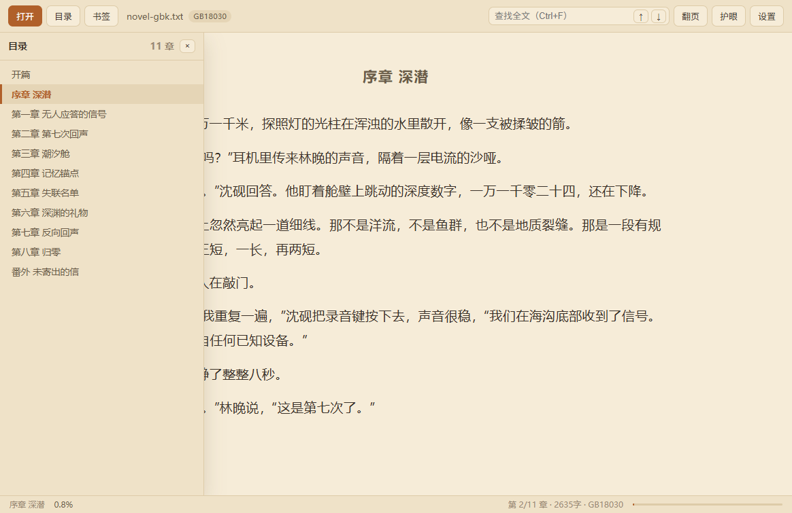

# TXT 阅读器

Electron 写的本地 TXT 小说阅读器。打开即读，自动识别中文编码，按章节切分、翻页/滚动阅读，记住每本书的阅读位置。


| 夜间主题 + 阅读设置 | 章节目录 | 全文查找 |
| --- | --- | --- |
|  |  |  |

## 功能

- **编码自动识别**：BOM → 无 BOM 的 UTF-16（NUL 位序）→ 严格 UTF-8 → GB18030/GBK/GB2312 与 Big5 打分择优；识别不准时可在「设置」里手动指定编码并重新加载。
- **章节目录**：识别 `第 N 章/节/回/卷/部/篇/集/话`、`序章`、`楔子`、`番外`、`终章` 等标题行，也识别网络小说常见的纯编号标题 `001 一切都那么美好`（要求编号构成连续递增序列，≥5 章才采信，避免把正文里的“5 分钟后”当成标题）；生成可跳转目录。无标题的纯文本按 4000 字自动分段，超长章节（>6 万字）自动再切分。
- **两种阅读模式**：翻页（CSS 多列分页，`←/→`、空格、点击左右两侧、滚轮翻页）与滚动（滚到底自动进入下一章）。
- **阅读设置**：主题（日间/护眼/夜间）、字体、字号、行距、字距、版心宽度、两端对齐，全部即时生效并保存。
- **书签与全文查找**：`Ctrl+B` 收藏当前页（记录章节 + 段落 + 预览），`Ctrl+F` 全文查找、上一处/下一处跳转并高亮命中。
- **进度记忆**：按文件路径记录章节、页内比例与全书百分比，下次打开自动回到原处；最近阅读列表可一键打开或移除。**文件被移动/改名后，同名同大小的新文件会自动沿用原进度与书签**（打开时提示「已沿用原阅读记录（第 N 章）」）。
- **拖拽打开**、命令行参数打开（`TXTReader.exe "D:\书\某小说.txt"`）、单实例（再次打开文件会聚焦已有窗口）。

## 使用

```bash
npm install
npm start          # 开发运行
```

> npm 12 起默认拦截依赖的 install 脚本，`electron` 的二进制不会自动下载。若 `npm start` 报 “Electron failed to install correctly”，执行一次 `npm run electron:install` 即可（本仓库已下载完成，无需重复）。

窗口标题栏菜单：文件 / 阅读 / 视图 / 帮助。

### 快捷键

| 按键 | 作用 |
| --- | --- |
| `Ctrl+O` | 打开文件 |
| `Ctrl+T` / `Ctrl+F` / `Ctrl+B` / `Ctrl+,` | 目录 / 查找 / 添加书签 / 阅读设置 |
| `←` `→` `空格` `PgUp` `PgDn` | 翻页（滚动模式下为翻屏） |
| `↑` `↓` | 翻页模式翻页；滚动模式逐行滚动，到顶/到底进入上/下一章 |
| `Home` / `End` | 全书第一章 / 最后一章 |
| `Ctrl+PageUp` / `Ctrl+PageDown` | 上一章 / 下一章 |
| `Ctrl+=` / `Ctrl+-` | 放大 / 缩小字号 |
| `F11` / `Esc` | 全屏 / 关闭面板 |

## 打包

```bash
npm run pack       # 免安装目录：dist/win-unpacked/
npm run dist       # 安装包 + 便携版：dist/TXTReader-1.0.0-setup.exe、TXTReader-1.0.0-portable.exe
npm run icon       # 重新生成 build/icon.png 与 build/icon.ico（纯 Node，无第三方依赖）
```

## 测试

```bash
npm test           # 单元测试：编码探测、章节切分（node:test）
npm run smoke      # 端到端冒烟：真实 Electron 窗口里跑完整交互，截图输出到 shots/
TXT_SMOKE_REAL="D:\书\某小说.txt" npm run smoke   # 额外用你自己的书跑一遍并截图
node scripts/gen-fixtures.mjs   # 重新生成各编码测试样本（需要 Windows PowerShell）
```

冒烟测试用独立的 `--user-data-dir` 运行，不会污染真实配置；它会依次验证 GBK / UTF-8+CRLF 无标题 / UTF-16LE / Big5 文件的识别与渲染、翻页与滚动、目录跳转、书签、查找、字号与主题切换、进度记忆、窗口缩放重排，并把每一步截图写入 `shots/`。

实测：13.5MB、486 万字、1733 章的真实网络小说，编码探测 + 切分合计约 50ms，翻页与目录跳转无卡顿。

## 目录结构

```
src/
  main/
    main.js       主进程：窗口、app:// 协议、IPC、命令行参数
    encoding.js   编码探测与解码（含 GB18030/Big5 打分）
    store.js      userData/state.json 持久化（窗口、设置、最近、每本书进度与书签）
    menu.js       中文应用菜单
  preload/
    preload.cjs   contextBridge 白名单 API（渲染进程无 Node 权限）
  renderer/
    index.html / app.css / app.js   阅读界面与翻页引擎
  shared/
    chapters.js   章节切分（纯函数，主进程/渲染/测试共用）
    settings.js   默认设置与字体主题常量
test/             单元测试与各编码样本
scripts/          冒烟测试、样本生成、图标生成
```

## 实现要点

- 渲染层通过自定义 `app://` 协议加载（`file://` 下 ES module 会被 CORS 拦），并带 CSP，禁用 `nodeIntegration`、开启 `contextIsolation` 与 `sandbox`。
- 正文一律用 `textContent` 注入，不拼接 HTML。
- 分页用 CSS 多列：`column-width = 版心宽度`、`column-fill: auto`，通过 `scrollLeft = 页号 × (列宽 + 列间距)` 翻页；窗口缩放、字号/版心变化时按页内比例保持位置。
- 只渲染当前章（大文件不整本入 DOM），查找与书签基于全局字符偏移映射到「章 → 段 → 段内偏移」。
- 查找高亮使用 CSS Custom Highlight API，不修改 DOM 结构。

## 已知限制

- 只支持 TXT（`.txt/.text/.log/.md`），不含 PDF/EPUB。
- 单文件上限 256MB；超长章节按 6 万字再切分。
- Shift_JIS、EUC-KR 等非中文编码不在自动识别范围内（可在设置里手动选择 UTF-8/GB18030/Big5/UTF-16）。
- 翻页模式下目录/设置抽屉是浮层，会遮住部分正文（关闭后恢复）。
